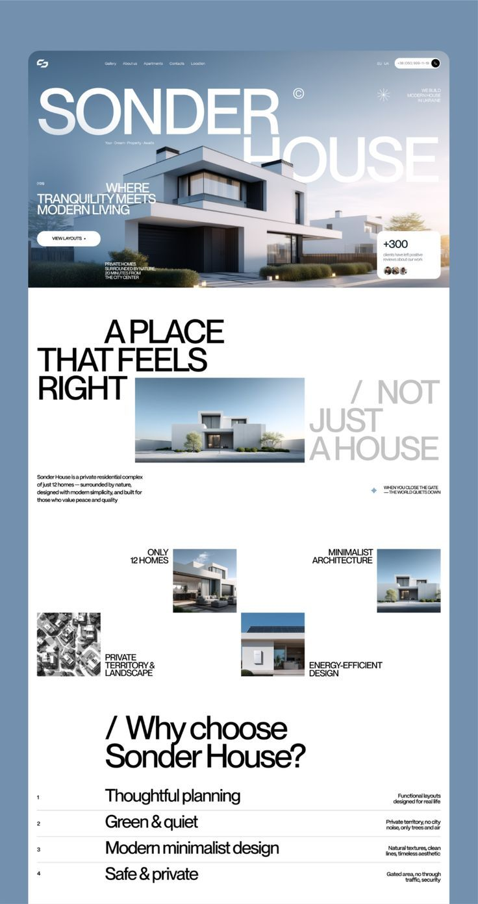
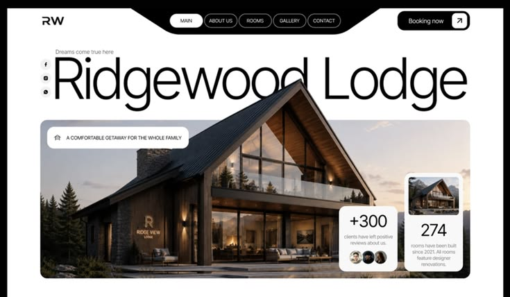
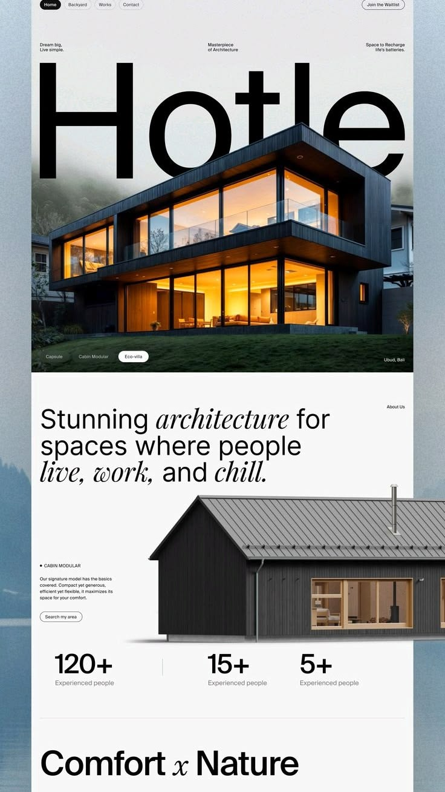
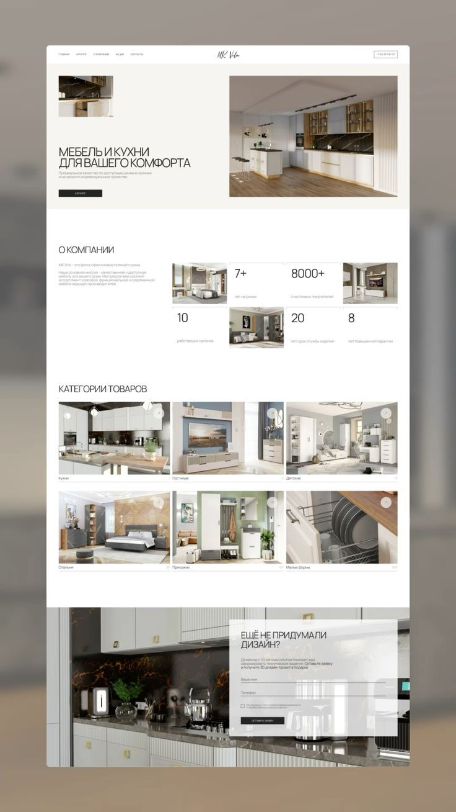
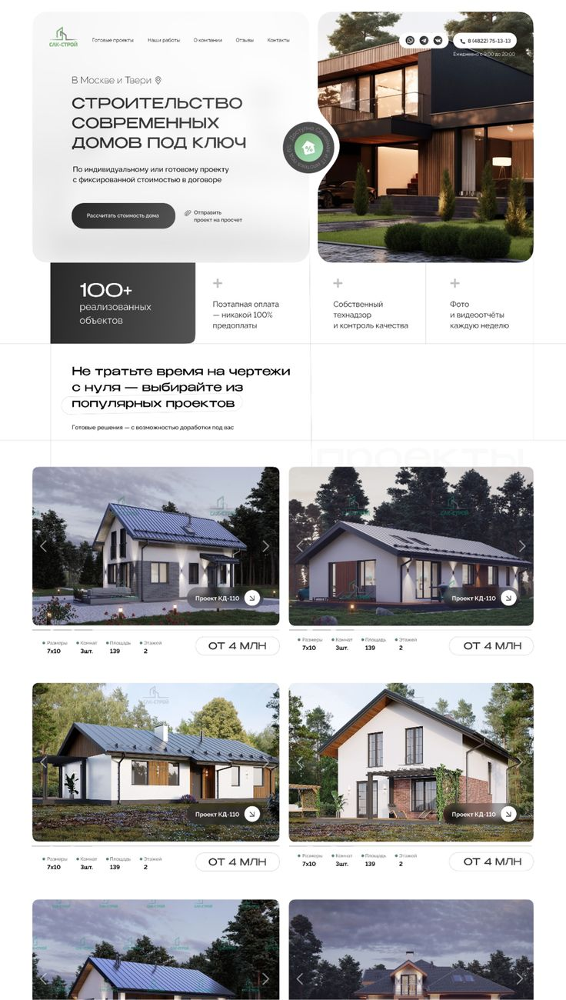

# Разбор референсов — редизайн sferihome.me

Метод: `hallmark study`, image mode. Пять референсов разобраны по одному протоколу —
поверхность (цвет) → шрифт → структура → движение → ритм. Изображения: `docs/references/`.

**Важное ограничение метода.** Шрифты по скриншоту не опознаются надёжно — ниже названы
*роли* и кандидаты, а не «точно такой-то шрифт». Точные значения цвета сняты на глаз,
их нужно будет свести по финальным макетам.

**Правило одного источника.** DNA берётся из одного референса, остальные влияют на
отдельные оси. Смешать пять в равных долях — верный способ получить «шаблонный суп».
Предложение по выбору основного — в конце.

---

## 01 · Sonder House — частный жилой комплекс

| Ось | Значение |
|---|---|
| Макроструктура | Marquee Hero → редакционный питч → асимметричная сетка изображений → таблица с волосяными линиями |
| Hero | H1 Marquee: гигантский вордмарк поверх фото, скруглённая карточка с отступом от краёв |
| Nav | N1: лого + 5 инлайн-ссылок + переключатель языка + телефон + аватар |
| Бумага | Белая `#FFFFFF`, холодно-нейтральная; в hero — голубовато-серый градиент неба |
| Акцент | Нейтральный. Хроматического акцента нет вообще, цвет приходит только из фотографий |
| Футпринт акцента | ≤ 5 % (крошечный синий ромб-маркер) |
| Дисплейный шрифт | Тяжёлый гротеск, прописные, очень плотный трекинг, предельно крупный кегль |
| Наборный | Нейтральный гротеск, мелкий (~11–13 px) |
| Плотность | Щедрая |
| Асимметрия | Левое смещение + асимметричные спаны сетки |

**Что здесь работает.** Контраст кегля — заголовок ~120 px против подписи 11 px, это
примерно 10:1. Такой разрыв сам по себе создаёт иерархию, поэтому ни цвет, ни рамки для
неё уже не нужны.

Три приёма, которые стоит забрать:

1. **Тип наезжает на изображение.** «SONDER» лежит поверх неба, «HOUSE» уходит за дом —
   слои, а не блоки друг под другом.
2. **Призрачная вторая половина заголовка.** «A PLACE THAT FEELS RIGHT» чёрным,
   «/ NOT JUST A HOUSE» серым в той же строке. Одна фраза, два голоса.
3. **Таблица вместо карточек.** «Why choose» — это строки с волосяными линиями:
   номер слева, тезис по центру, расшифровка справа. Плотнее и дороже, чем четыре
   одинаковые карточки.

**Асимметричная сетка (4 ячейки).** Изображения разного размера, сдвинуты по вертикали,
подписи прижаты к своим картинкам вплотную, а не отцентрованы. Читается как раскладка
в журнале.

---

## 02 · Ridgewood Lodge — загородный отель

| Ось | Значение |
|---|---|
| Макроструктура | Marquee Hero (виден только первый экран) |
| Hero | H6 Photographic: скруглённая фотокарточка, поверх — плавающие белые стат-карточки |
| Nav | N5 Floating pill: чёрные пилюли-ссылки + «Booking now ↗» |
| Бумага | Белая, нейтральная |
| Акцент | Нейтральный; тепло даёт дерево на фото |
| Дисплейный шрифт | **Лёгкий** геометрический гротеск, широкий, строчные с прописной |
| Плотность | Щедрая |

**Главное отличие от 01 — вес дисплея.** Здесь тонкий и широкий, там тяжёлый и узкий.
Это два разных характера, и выбрать придётся один: тонкий читается как «спокойствие,
воздух, отдых», тяжёлый — как «уверенность, масштаб, инженерия».

**Что забрать.** Пилюльная навигация, вертикальный столбец соцсетей на левом поле,
плавающие стат-карточки на фотографии.

---

## 03 · Hotle — модульные дома

| Ось | Значение |
|---|---|
| Макроструктура | Marquee Hero с обрезкой типа по краям вьюпорта |
| Hero | H1 Marquee + H6: «Hotle» уходит за оба края, дом перекрывает нижнюю часть букв |
| Nav | N5 Floating pill слева + «Join the Waitlist» справа |
| Бумага | Светло-серая `≈#F2F2F2`, холодная |
| Акцент | Нейтральный |
| Дисплейный шрифт | Очень лёгкий гротеск, предельный кегль |
| Наборный | **Антиква с италиком** — единственный референс с засечками |
| Плотность | Щедрая |

**Фигура и фон.** Тип уходит за края экрана и частично скрыт зданием — читатель
достраивает слово сам. Приём сильный, но требует, чтобы слово узнавалось по фрагменту.
Для «SFERI» это сработает, для длинного названия — нет.

**Верхняя строка из трёх микроподписей** («Dream big, Live simple.» / «Masterpiece of
Architecture» / «Space to Recharge») — три колонки мелкого текста над hero. Дешёвый по
затратам и очень эффективный способ задать тон до первого заголовка.

**Оговорка.** Заголовок «Stunning *architecture* for spaces where people *live, work,*
and *chill*» использует италик для выделения слов. В нашем чек-листе это запрещено
(gate 38a: италик в заголовках — один из самых надёжных признаков сгенерированной
страницы). В референсе приём выглядит уместно, потому что курсив там — часть
характера антиквы, а не подсветка одного слова. Если берём антикву, выделение несём
насыщенностью, а не наклоном.

---

## 04 · MK Vita — мебель и кухни

| Ось | Значение |
|---|---|
| Макроструктура | Каталог в центрированном контейнере |
| Hero | H2 Split: текст слева, фото справа, всё внутри кремовой карточки |
| Бумага | Тёплый кремовый `≈#F5F2ED` поверх белого листа |
| Акцент | Почти чёрные кнопки; тёплая гамма из фотографий |
| Дисплейный шрифт | Узкий гротеск, прописные, разреженный трекинг |
| Плотность | Средне-плотная |

**Самый слабый референс в наборе** — и полезно понимать, чем именно:

- центрированный «лист» поверх размытой фотографии — приём из 2016 года;
- прописные с разрядкой во всех заголовках подряд — признак шаблона, а не решения;
- шахматка «цифра — картинка — цифра» в блоке «О компании» тесная, цифры и фото
  борются за внимание.

**Что всё-таки забрать.** Сама идея шахматки: статистика не отдельной полосой, а
вперемешку с изображениями. При большем воздухе и разнице кеглей приём работает.

---

## 05 · САК-Строй — дома под ключ

| Ось | Значение |
|---|---|
| Макроструктура | **Каталог** — и это ближе всего к задаче сайта о домах |
| Hero | Бенто: скруглённая белая карточка с текстом + скруглённая фотокарточка |
| Бумага | Светло-серая `≈#F0F0F0` |
| Акцент | **Зелёный** — единственный хроматический акцент во всём наборе, футпринт ≤ 5 % |
| Дисплейный шрифт | Гротеск среднего веса, обычный регистр |
| Плотность | Средняя, модульная |

**Полоса преимуществ на четыре ячейки.** Три ячейки светлые с маркером «+», одна залита
тёмным. Одна закрашенная ячейка задаёт ритм всей полосе — приём дешёвый и точный.

**Карточка проекта — то, что понадобится, если у sferihome есть каталог домов:**
фото со стрелками карусели → строка спецификаций (Размеры · Комнат · Площадь · Этажей) →
цена в пилюле «ОТ 4 МЛН». Спецификации набраны мелко и ровно, цена вынесена в отдельную
форму — глаз находит её мгновенно.

**Что не забирать.** Гигантский водяной знак «ПРОЕКТЫ» за секцией — декоративное клише.
Стрелки карусели на каждой карточке в сетке — шум; карусель внутри ячейки сетки
конфликтует с прокруткой страницы.

---

## Общая ДНК набора

Девять черт, которые повторяются минимум в трёх референсах из пяти.

**Цвет**

1. **Светлая бумага везде.** Ни одного тёмного макета. Лёгкость — сознательный выбор
   категории, а не случайность.
2. **Хроматического акцента почти нет.** Четыре референса из пяти — чернила на бумаге;
   весь цвет приходит из архитектурной фотографии. Только САК-Строй добавляет зелёный,
   и то на ≤ 5 % площади. **Это главный вывод по цвету: фирменный цвет не разливается
   по интерфейсу, он живёт в логотипе и мелких маркерах, а цвет страницы делают фото.**
3. Расхождение по температуре: холодный нейтральный у 01, 03, 05 — тёплый кремовый у 04.

**Шрифт**

4. **Предельный контраст кегля.** Дисплей 100–140 px против подписей 11–13 px.
   Это несущая конструкция иерархии во всех пяти макетах.
5. **Один гротеск на всё.** Антиква появляется только в 03. Разные роли берутся
   насыщенностью и кеглем, а не второй гарнитурой.
6. Расхождение по весу: тяжёлый (01, 04) против тонкого (02, 03). **Ось, по которой
   нужно принять решение.**

**Композиция и сетка**

7. **Фотография в скруглённых карточках с отступом от краёв.** 01, 02, 03, 05. Не
   full-bleed. Страница читается как лист бумаги, на котором лежат снимки.
8. **Плавающие карточки со статистикой поверх фото.** 01, 02; в виде полосы — 03, 04, 05.
9. **Пилюли как единый голос элементов.** Навигация (02, 03), кнопки (01, 04),
   ценники и фильтры (03, 05). Скругление «на полную» — общий знаменатель.

Дополнительно в трёх из пяти: **строки данных с волосяными линиями** вместо карточек
(нумерованная таблица в 01, разделители статистики в 03, строка спецификаций в 05).

---

## Что из этого не брать

Честные метрики — отдельный пункт. Во всех референсах встречается «+300 clients have
left positive reviews», «274 rooms», «8000+ счастливых покупателей», «100+ реализованных
объектов». Числа в макетах подставные. **Для sferihome нужны реальные цифры либо
структура блока без цифр** — выдуманная статистика на живом сайте это и юридический,
и репутационный риск.

Остальное к исключению: центрированный лист на размытом фоне (04), прописные с
разрядкой во всех заголовках подряд (04), водяной знак за секцией (05), карусель
внутри каждой карточки сетки (05), италик для выделения слов в заголовке (03).

---

## Предложение по основному референсу

По правилу одного источника backbone берётся из одного макета:

**Основной — 01 Sonder House.** Причины: это жилой комплекс, то есть ближайшая к
задаче категория; самый высокий уровень исполнения в наборе; его макроструктура
(marquee hero → редакционный питч → асимметричная сетка → таблица с линейками)
переиспользуется целиком.

**Остальные — влияние по отдельным осям:**

| Референс | Что берём |
|---|---|
| 05 САК-Строй | блок каталога домов: карточка, строка спецификаций, ценовая пилюля; полоса преимуществ с одной залитой ячейкой |
| 02 Ridgewood | пилюльная навигация, плавающие стат-карточки |
| 03 Hotle | строка из трёх микроподписей над hero; обрезка дисплейного типа по краям |
| 04 MK Vita | только идея шахматки «статистика вперемешку с фото» |

---

## Открытые вопросы

Разбор референсов закончен и от ответов не зависит. Дальнейшая работа — зависит.

1. **Чем занимается sferihome.me и что на сайте сейчас?** Домен закрыт egress-политикой
   этого окружения (шлюз отдаёт 403), открыть его отсюда нельзя. Нужны скриншоты текущего
   сайта либо выгрузка текстов и структуры.
2. **Есть ли каталог объектов?** Это решает макроструктуру: Marquee Hero (01) для
   имиджевого сайта против Каталога (05) для сайта с подбором домов. Разные скелеты,
   не вариации одного.
3. **Вес дисплея — тяжёлый или тонкий?** Ось из пункта 6. Тяжёлый = уверенность,
   масштаб, инженерия. Тонкий = спокойствие, воздух, приватность.
4. **Языки интерфейса.** От набора письменностей зависит выбор гарнитуры: кириллица
   плюс латиница заметно сужают список.
